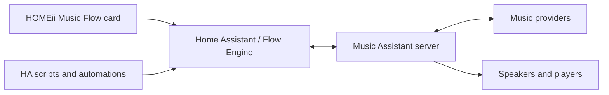

<p align="center"></p>
<h1 align="center">HOMEii Flow Engine</h1>
<p align="center"><strong>The connection between your music dashboard and your smart home.</strong><br>Music Assistant state, playback and home automation — through Home Assistant.</p>
<p align="center"></p>
<p align="center"><a href="https://github.com/r11a/homeii-music-flow">Music Flow card</a> · <a href="#installation">Installation</a> · <a href="#configuration-fields">Configuration</a> · <a href="#automations-you-can-build">Automations</a> · <a href="#troubleshooting">Troubleshooting</a> · <a href="docs/BETA_UPGRADE_HE.md">עברית</a></p>

> [!IMPORTANT]
> **Public beta: Engine `1.0.0-beta.1` + card `6.0.0-beta.1`.** Install the Engine first. This is an opt-in prerelease, not a production-readiness guarantee.

> [!WARNING]
> **Upgrading the card from 5.9.3 requires installing this Engine first.** The 6.0 card is not a standalone replacement JavaScript file. Keep 5.9.3 active until the Engine is installed, configured and loading successfully. Back up HA, the dashboard, resource URL and previous files before testing. The Engine can execute schedules, timers and volume rules even when the dashboard is closed.


## Install the Engine — start here

**BETA: back up Home Assistant first. Install the Engine before upgrading the card from 5.9.3.**

### 1. Download with HACS

[](https://my.home-assistant.io/redirect/hacs_repository/?owner=r11a&repository=homeii-flow-engine&category=integration)

HACS must already be installed. This is a **custom repository**, not an official HACS default listing. If the button cannot find it, open **HACS → ⋮ → Custom repositories**, add `https://github.com/r11a/homeii-flow-engine`, choose **Integration**, and add it. Open HOMEii Flow Engine, select/download **1.0.0-beta.1** (enable beta/pre-release versions if needed), then **restart Home Assistant**. The button opens HACS; it does not silently install anything.

### 2. Add and configure the integration after restarting

[](https://my.home-assistant.io/redirect/config_flow/?domain=homeii_flow)

Or go to **Settings → Devices & services → Add integration → HOMEii Flow Engine**.

- **Automatic:** enter the direct Music Assistant server URL and your MA built-in username/password to create a dedicated token. These are not your HA credentials; the password is not stored.
- **Manual:** create a long-lived token in **Music Assistant → Settings → Profile**, then paste it into the Engine form.
- Use your actual MA server address, for example `http://YOUR-MA-HOST:8095`. Do not paste the HA sidebar/ingress page URL.
- Keep **Instance ID** and **Default Profile ID** as `default` for a standard installation. They identify this Engine connection and its default saved profile.
- Confirm the integration loads before installing the matching card.

If My Home Assistant opens the wrong server, change its instance URL to your own HA address. If the integration is not found, confirm the files were installed and HA was restarted.

### Manual installation without HACS

Download [homeii-flow-engine-1.0.0-beta.1.zip](https://github.com/r11a/homeii-flow-engine/releases/download/v1.0.0-beta.1/homeii-flow-engine-1.0.0-beta.1.zip), extract it, and copy the complete `custom_components/homeii_flow` folder into `/config/custom_components/`. The resulting file must be `/config/custom_components/homeii_flow/manifest.json`. Restart HA, then use **Add integration** above. Do not create an extra nested `custom_components` directory.

## Artwork lighting and listening insights (local beta candidate)

The Engine can maintain **per-player artwork lighting while the dashboard is closed**. Assign existing color-capable HA lights in the card's Smart Home settings, select the corresponding player, open **Players → Lighting follow**, and enable it. The Engine saves that player's assignment; enable additional players individually. Its `lighting/get` and `lighting/set` WebSocket commands return the stored rules and current status. Restarting HA preserves assignments. The card stops issuing parallel browser-side lighting commands when this capability is available.

The controller listens to player state changes and reconciles every 10 seconds. It reads artwork through HA's media-player image interface, extracts a representative color in an executor, and sends color/brightness through HA light services. Maximum brightness follows the configured limit and player volume. A cooldown avoids repeated light commands; stale downloads cannot apply a previous track's colors. Unsupported/offline lights are reported as partial results. Disabling follow stops future updates; it does not turn lights off or restore a prior scene. A light cannot follow two enabled player assignments simultaneously. This is artwork-color following, **not beat detection**. Physical-light validation remains part of beta acceptance.

Listening insights use the existing Engine history, not browser-open time. The card shows today's listening minutes, sessions, per-player totals and the most active player. HA already receives **Playback today**, **Playback sessions today**, and **Top player today** sensors for dashboards and automations. Totals sum player activity and may count simultaneous playback on multiple players.

Radio Browser station queries can also run through the Engine (`radio/search`). Returned station logos use the same HA-local artwork proxy as MA artwork, avoiding lost images in the required-Engine card. Public directory entries with missing logos remain without a fabricated image; metadata quality varies by station.

## One experience, two repositories

| Component | What it does | Repository |
|---|---|---|
| Music Flow `6.0.0-beta.1` | Artwork-driven player, contextual wheels, library, queue, lyrics and touch interface | [HOMEii Music Flow](https://github.com/r11a/homeii-music-flow) |
| Flow Engine `1.0.0-beta.1` | Required HA integration that connects the card and automations to MA | [HOMEii Flow Engine](https://github.com/r11a/homeii-flow-engine) |

The Engine is **not an add-on or a Music Assistant server**. It does not replace MA or HA's official Music Assistant integration. The browser connects to HA; the Engine maintains authenticated MA access and shares useful state with the card. MA remains authoritative for players, media and queues.



## What the Engine enables

| Capability | Value for your home | Important boundary |
|---|---|---|
| Authenticated MA connection | A persistent server connection, player identity mapping and event updates shared through HA | MA URL/token stays in the integration config; HA admin access and backups still need protection |
| Player controls | Play, pause, stop, next/previous, volume, mute and seek from the card or HA actions | Commands depend on player/media support; seek is not possible on every stream |
| Queue state and actions | Complete paginated queue reads, active-queue ownership, transfer and mutations | The backend rejects inconsistent/partial snapshots rather than certifying them as complete |
| Library and search | Albums, tracks, artists, playlists, radio and podcast reads with caching and pagination | Providers determine available catalogs and metadata; a cache is not proof of current connectivity |
| Artwork and favorites | HA-mediated artwork access, favorite reads/writes and revisioned snapshots | No guarantee that every provider item has artwork or accepts library writes |
| Multi-room | Group orchestration and fresh readback for command confirmation | Sustained group persistence and device-specific protocols remain beta test areas |
| Timers and schedules | Sleep timers and scheduled playback without leaving a browser open | HA and MA must be running; this is not a safety-critical scheduler or guaranteed alarm system |
| Volume policies | Stored player limits with visible controls and optional time windows | Applying a policy may change real speaker volume; test one player first |
| Announcements | HA TTS media-source integration and MA announcement handling | Requires configured TTS and player support; audible resume behavior needs hardware testing |
| Playback preferences | Autoplay, crossfade and supported MA defaults with validation/readback | Global defaults affect all MA players; per-queue controls are separate |
| Spoken-media speed | 0.5–3.0 playback speed for supported podcasts/audiobooks | Ordinary music and unsupported media are rejected |
| AI Radio DJ | List configured MA hosts and read/set queue DJ state | Requires MA 2.11 beta API/plugin/configuration; model credentials and host authoring stay in MA |
| Sendspin relay | Authenticated transport for the card's This device playback | MA support and browser audio permissions still apply; mobile background behavior is not guaranteed |
| Diagnostics and entities | Connection health, player/queue information, activity, schedules and policies visible in HA | Statistics are operational aids, not billing/auditing records |
| Optional system screensaver | Artwork and now-playing information beyond the card's own screen | Separate frontend module; browser loading and device behavior require testing |

## Requirements

- Home Assistant with custom integrations enabled. HACS metadata declares `2025.1.0` as the floor; this does not certify every HA version since then. Use a current supported Core version for beta testing.
- The **official Music Assistant HA integration** installed and loaded. It is declared as a dependency in this integration's manifest.
- Music Assistant exposing **API schema 63 or newer**, with a valid MA API token. Development work covers MA 2.10/2.11 beta APIs; some earlier 2.10 builds are incompatible. The handshake checks schema, not just the displayed MA release name.
- HA can reach the real MA HTTP(S) API/WebSocket address, including its port. Do not use an HA ingress page as the API URL.
- At least one working MA player, exposed through the official integration, and the relevant provider/TTS/AI setup for optional features.
- For development outside HA: Python 3.12+ is declared in `pyproject.toml`; running in HA uses HA's managed Python runtime.

## Installation

### Before a beta is published

This repository currently contains a candidate branch only. Do not expect a release download or an automatically available HACS beta. Access to a private repository must be granted separately. The instructions below describe the intended install layout and the steps to use once an exact candidate/package is deliberately selected.

### Manual installation

1. Back up HA and any existing `custom_components/homeii_flow` directory.
2. Obtain the exact Engine beta package/source commit intended for testing, not an unrelated moving branch.
3. Copy **the `homeii_flow` directory inside `custom_components`** to `/config/custom_components/homeii_flow`.
4. Verify this exact layout:

```text
/config/custom_components/homeii_flow/
  __init__.py
  manifest.json
  config_flow.py
  runtime.py
  websocket_api.py
  services.yaml
  translations/
  frontend/
  ...other files from the package
```

5. `manifest.json` must be directly inside `homeii_flow`. Do not copy a repository ZIP as an integration, copy only one Python file, or create `homeii_flow/homeii_flow/manifest.json` accidentally.
6. Run HA's configuration check, then **restart Home Assistant**.
7. Go to **Settings → Devices & services → Add integration → HOMEii Flow Engine**.
8. Fill the connection fields below and complete setup. Check for setup errors before installing the 6.0 card.

### HACS installation after public availability is arranged

Add `https://github.com/r11a/homeii-flow-engine` as a custom **Integration** repository, deliberately select the exact beta, download it and restart HA. Adding it in HACS installs files; it does **not** replace the Add integration/configuration steps. The matching [card repository](https://github.com/r11a/homeii-music-flow) is a separate **Dashboard** repository.

For an existing development installation, retain its config entry, update the full component directory and restart. Do not delete the entry just to change the MA URL or token. The jump from development `0.7.21` to `1.0.0-beta.1` is beta version labeling; it does not intentionally reset stored schedules or profiles.

## Configuration fields

| Field | What to enter | Example / guidance |
|---|---|---|
| Instance ID | Stable Engine instance identifier | Leave `default` for a single installation |
| Profile ID | Namespace for stored HOMEii schedules/settings | Leave `default` unless deliberately separating profiles; changing it can make another profile's records appear absent |
| Music Assistant URL | MA server HTTP(S) base URL reachable **from HA** | `http://192.168.1.10:8095` is an example, not a universal port |
| External MA URL | Optional external HTTPS server/API fallback | Use only if you have intentionally configured that route. It is not the HA dashboard/ingress URL and does not automatically solve browser audio restrictions |
| MA API token | A valid Music Assistant API token | Create it in your MA installation; do not use an HA token or paste it into dashboard YAML, screenshots or issues |
| Experimental features | Optional test features | Leave disabled for initial connection testing; it is not a remedy for an unsupported server schema |

To update an existing connection: **Settings → Devices & services → HOMEii Flow Engine → Configure → General settings**. Leaving the token field blank in that edit flow preserves the saved token. Initial setup requires a token.

Keep the official MA integration installed. First resolve failures in native MA; HOMEii cannot repair an offline provider or a speaker unsupported by MA.

## Connect the card

After the Engine loads, install the exact matching `6.0.0-beta.1` card. Configure connection credentials in the Engine only:

```yaml
type: custom:homeii-music-flow
homeii_engine_mode: required
```

Do not load the old and new card scripts simultaneously. Run card diagnostics and confirm the Engine version, MA connection and selected player. The complete [5.9.3 upgrade guide](https://github.com/r11a/homeii-music-flow/blob/codex/v6-release-candidate/docs/BETA_GUIDE.md) explains resource changes, rollback and browser settings.

## Entities you can use in HA

The integration declares sensor, binary sensor, switch, button, number and calendar platforms. Entities depend on the configured profile and stored records; not every installation immediately has a schedule or a volume-rule entity.

| Platform | Examples of exposed information/actions |
|---|---|
| Sensors | Engine/MA status, player counts, playing/grouped players, next schedule/timer and stored policy information |
| Binary sensors | Playing/grouped state and active volume-policy status |
| Switches | Stored schedules, timers, volume rules and system screensaver enablement |
| Buttons | Refresh/orchestration, running a schedule now and showing the screensaver |
| Numbers | Rule volume controls and screensaver timeout |
| Calendar | Upcoming stored HOMEii schedules |

Actual entity IDs are generated by HA and may have suffixes. Select them in the UI; do not assume an example entity ID exists in your installation.

## Automations you can build

Use **Developer tools → Actions** (called Services in older HA versions), or HA scripts. The following are action snippets, not complete trigger-based automations. Replace `media_player.kitchen` with your real MA entity. They can affect a real speaker immediately.

### Seek to a position in a track

```yaml
action: homeii_flow.player_command
data:
  player: media_player.kitchen
  command: seek
  seek_position: 90
```

Position is in seconds and requires seekable media. For a supported podcast/audiobook use `command: playback_speed` and `speed: 1.25` instead.

### Set a 30-minute sleep timer

```yaml
action: homeii_flow.set_timer
data:
  profile_id: default
  id: bedtime_kitchen
  player: media_player.kitchen
  action: stop
  minutes: 30
  enabled: true
```

Cancel with `homeii_flow.delete_timer`, `profile_id: default`, `id: bedtime_kitchen`. It is stored by the Engine and does not depend on the card staying open; HA must remain running to execute it.

### Add an overnight volume limit

```yaml
action: homeii_flow.set_volume_rule
data:
  profile_id: default
  player: media_player.kitchen
  max_volume: 25
  start_time: "22:00"
  end_time: "07:00"
  enabled: true
```

The rule can lower volume while active. Check your HA timezone and test its boundaries. Profile-wide `clear_volume_rules` removes all rules for that profile; prefer individual edits/deletion when that is the intent.

### Set MA's global playback defaults deliberately

```yaml
action: homeii_flow.set_queue_settings
data:
  autoplay_enabled: true
  autoplay_mode: library
  smart_shuffle_enabled: enabled
```

This administrator action changes **global MA defaults**, not just one card/player. Only supported fields are accepted; unspecified fields remain unchanged and saved values are read back. Per-queue controls use `homeii_flow.player_command`, for example `command: crossfade` with `crossfade_enabled: true`.

### Scheduling and other services

The Configure flow offers guided menus for stored schedules, timers and rules. `homeii_flow.set_schedule` accepts the player, local time, media and optional days/volume; `homeii_flow.run_schedule` tests a saved ID immediately. Check the [service definitions](custom_components/homeii_flow/services.yaml) for exact fields and units before writing an automation. Day indices use **Sunday = 0**. Use a valid media URI from your own MA library, not a made-up example URI.

Other actions include `play_media`, `transfer_queue`, `announce`, `delete_schedule`, `delete_volume_rule`, `run_orchestration`, `set_screensaver` and `show_screensaver`. Announcement/TTS configuration and the selected target matter; test on one speaker before expanding to rooms.

## Optional system screensaver

The served frontend module is `/homeii_flow/homeii-flow-system-screensaver.js`. Add it as a JavaScript module resource and enable the System screensaver entity/setting only if wanted. It is separate from the card's own screensaver and may appear elsewhere in the HA dashboard.

For non-dashboard HA pages, where Lovelace resources may not load, an advanced option is:

```yaml
frontend:
  extra_module_url:
    - /homeii_flow/homeii-flow-system-screensaver.js
```

Merge into your existing `frontend` section rather than duplicating it. Check configuration, restart HA and refresh the browser. This optional module is not required for music playback.

## Diagnostics, permissions and privacy

Run card Diagnostics and inspect the Engine integration/device page. Check MA handshake/schema, connected player identity, active queue, command errors and recent Engine activity. API secrets are kept in HA's config entry rather than serialized to the card; that does not make an HA backup safe to share publicly.

Card access uses authenticated HA routes. Administrative/global operations retain their own permission requirements; do not grant extra access simply to hide a permission error. Lyrics external lookup, AI services and music providers have separate privacy/cost behavior configured in their respective systems.

The card/Engine WebSocket interface includes context, players, playback, queue, library, search, favorites, groups, schedules, timers, volume policies, announcements and Sendspin. Developers can inspect [registered commands](custom_components/homeii_flow/websocket_api.py); the beta API can still evolve, so prefer documented HA actions for user automations.

## Troubleshooting

| Symptom | Check first |
|---|---|
| Integration not found | Full folder layout, a direct `manifest.json`, HA restart and custom integration logs |
| Setup/authentication fails | MA API URL/port, reachability from HA, valid MA token, schema 63+ and official integration loaded |
| Card says Engine required | Engine entry loaded, card resource version, HA authenticated connection; do not restore a frontend token workaround |
| No players or wrong player | Native MA availability, official HA exposure, configured entity/profile and pinned/excluded filters |
| Queue missing or slow | MA active queue ownership, Engine diagnostics and provider response; distinguish unavailable from empty |
| Group dissolves | Compare directly in MA. On generic Up2Stream/Rakoit LinkPlay with MA 2.11.0b2, enable the existing DLNA provider and verify both physical devices are discovered: AirPlay may become unavailable in follower mode, causing MA to remove the member. Native grouping remains LinkPlay. Other hardware/versions need separate verification. |
| No lyrics | Whether MA returns lyrics for that exact item; synchronization/lyrics are not universal |
| This device fails | MA Sendspin support, secure access where required, a user audio gesture and browser permissions/background restrictions |
| Timer/rule seems absent | Same profile/instance, HA timezone, enabled status and HA uptime |
| Old version remains | Complete component update + HA restart for Engine; resource URL/cache + browser reload for card |

## Upgrade, rollback and beta expectations

Back up before each candidate. Keep the old component directory and full HA backup together: restoring Python files alone may not restore changed configuration/storage. To return to card 5.9.3, restore its module, single resource URL and saved dashboard config. Disable beta-created Engine schedules/rules you no longer want; the card being closed or downgraded does not stop backend tasks. Do not hand-edit `.storage` as an improvised downgrade.

The intended publication is **Pre-release, not Latest**. Users who enable betas or custom update automations can still get prereleases; the repository cannot disable those automations for them. Testers should select exact versions and disable automatic updates for these two components if they want manual control. No release/tag is created by this documentation preparation.

Open beta areas include long-running groups, device-specific DLNA, Safari/iOS background audio, audible TTS resume, timing/recovery scenarios and the broader card layout matrix. AI DJ depends on configured MA support. No claim is made that all open community requests are implemented.

## Reporting and contributing

[Engine issues](https://github.com/r11a/homeii-flow-engine/issues) are for integration setup, backend behavior and services; [card issues](https://github.com/r11a/homeii-music-flow/issues) are for visual behavior and card navigation. The Engine tracker is visible only to permitted users while the repository is private.

Report both HOMEii versions, HA and MA versions/schema, player model/protocol, provider, exact steps, expected/actual result, native MA comparison and redacted diagnostics. For announcements or groups specify the target speakers. Never post tokens, cookies or full backups.

Validation commands:

```sh
python -B -m unittest discover -s tests
python -B scripts/validate_repo.py
```

The preceding 0.7.21 source passed 52 regression tests and repository validation. Beta version labeling and package validation are checked separately; a passed unit suite does not certify every home installation. Runtime/state, MA transport, queue validation and Sendspin are separate responsibilities in the source, although `runtime.py` still needs further focused modularization.

## Identity and credits

HOMEii Flow uses the same gold wave mark in both projects. Root `icon.png`/`logo.png`, integration assets and screensaver assets retain their natural aspect ratio. README images link to local repository assets, so they do not depend on an unpublished tag. HA's integration-brand catalog is a separate publication process; placing icons in this repository alone does not guarantee every HA/HACS surface displays them.

Built for Home Assistant and Music Assistant, with community feedback shaping the beta. See the [card repository](https://github.com/r11a/homeii-music-flow) for interface credits and community translations, including the German contribution by rtreichl.


### Shared night display preferences

The card's Smart screen can save night display mode, start/end times and active days in the Engine per profile. Other cards using the same profile receive these preferences in Engine context on refresh/startup. Display night mode does not lower speaker volume; use volume policies for that purpose.

Use the Home Assistant action `homeii_flow.set_interface_preferences` with `profile_id`, `night_mode` (`off`, `on`, `auto`), `night_start` and `night_end` in `HH:MM`, and `night_days` (0 Sunday through 6 Saturday). The card uses `homeii_flow/interface/get` and `homeii_flow/interface/set`; all paths share the same persisted store and validation. Existing card-local night settings remain the fallback until the profile has stored values.

The Smart screen also edits the existing system screensaver and artwork-lighting configuration. System screensaver display still requires the separate frontend resource described above. Artwork-lighting status reports `updated_at`, `media_title`, `rgb` and failures, enabling verification of actual backend updates while dashboards are closed. A reported update is not an acoustic or visual hardware inspection.

## Guided connection

Choose Automatic to create a dedicated token using your Music Assistant built-in username and password (not your Home Assistant credentials). The password is not stored. Alternatively choose Manual and paste a long-lived token from Music Assistant Settings → Profile. HA ingress URLs are rejected with guidance to use the direct MA server address. Keep Instance ID and Default Profile ID as default for a standard single installation.

[Beginner installation and rollback guide](https://github.com/r11a/homeii-music-flow/blob/v6.0.0-beta.1/docs/INSTALL_STEP_BY_STEP.md).


